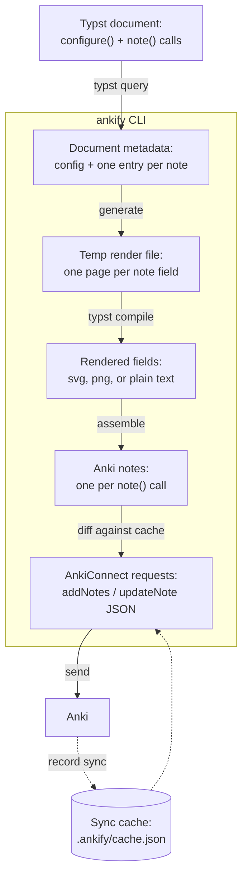

<br>
<div align="center">
<picture>
    <source media="(prefers-color-scheme: dark)" srcset="https://raw.githubusercontent.com/nvlang/ankify/main/res/dark/logotype.svg">
    <source media="(prefers-color-scheme: light)" srcset="https://raw.githubusercontent.com/nvlang/ankify/main/res/light/logotype.svg">
    
</picture>
<br>
<br>
<p><em>Turn your Typst lecture notes into Anki flashcards.</em></p>
</div>
<br>

> **Alpha** — Ankify is alpha software under active development. Expect
> bugs, rough edges, and breaking changes between releases.

Ankify lets you take notes in [Typst](https://typst.app) the way you normally
would and, with very little extra effort, generate an [Anki](https://apps.ankiweb.net)
flashcard for each definition, theorem, lemma — whatever you like.

The trick: you write a small helper function that both typesets an item in your
notes *and* registers a flashcard for it. Define it once, and every definition
or theorem in your document becomes a card.

## How it works

The project has two parts:

- **The `ankify` Typst package** — provides `configure()` and `note()`. Calling
  `note()` records a flashcard as document metadata; it produces no visible
  output, so you call it from inside your own helpers.
- **The `ankify` CLI** — reads a `.typ` file, renders each note's fields, and
  pushes them to Anki through the [AnkiConnect](https://foosoft.net/projects/anki-connect/)
  add-on.

When you run `ankify notes.typ`, the CLI:

1. queries the document for note metadata and configuration;
2. renders each note field — to an image, so math and formatting survive;
3. sends `addNotes` / `updateNote` requests to AnkiConnect;
4. records what it pushed in a cache (`.ankify/cache.json`), so the next run
   only syncs notes that were added or changed.



## Requirements

- **Anki**, running, with the **AnkiConnect** add-on installed.
- The **Typst** CLI (`typst`) on your `PATH`.
- A **Rust** toolchain, to build the CLI.

## Installation

### Typst package

Until `ankify` is published to the Typst Universe, install it locally so it can
be imported as `@preview/ankify:0.1.0`. Copy `packages/ankify-typst/` into your
Typst package directory:

```sh
# macOS
DEST="$HOME/Library/Application Support/typst/packages/preview/ankify/0.1.0"
# Linux:   ~/.local/share/typst/packages/preview/ankify/0.1.0
# Windows: %APPDATA%\typst\packages\preview\ankify\0.1.0

mkdir -p "$DEST" && cp -r packages/ankify-typst/* "$DEST"
```

### CLI

```sh
cargo install --path packages/ankify-cli
# or: cargo build --release  ->  ./target/release/ankify
```

## Usage

### A first card

```typ
#import "@preview/ankify:0.1.0": note, configure

#configure(defaults: (deck: "My Course"))

#note(
  "pythagoras",
  data: (Front: "Pythagorean theorem?", Back: [$a^2 + b^2 = c^2$]),
)
```

Start Anki, then run:

```sh
ankify notes.typ
```

### The real workflow: helpers

`note()` shines when wrapped in a helper that also renders the item. Define a
`definition` / `theorem` helper once, then every use of it becomes a card:

```typ
#import "@preview/ankify:0.1.0": note, configure

#configure(defaults: (deck: "Analysis", tags: ("analysis",)))

#let definition(label, term, body) = {
  note(label, data: (Front: [Define: #term], Back: body))
  block(inset: 8pt, stroke: 0.5pt)[*Definition (#term).* #body]
}

= Lecture 3: Continuity

#definition("def-continuity", "continuity")[
  A function $f$ is continuous at $a$ if $lim_(x -> a) f(x) = f(a)$.
]
```

Take notes as usual; each `definition(...)` both typesets the definition and
produces a flashcard.

### `note()`

| Parameter | Meaning | Default |
|---|---|---|
| label *(positional)* | Unique identifier; the sync key for the card. | — |
| `data` | Dictionary of Anki field name → content/string. | — |
| `deck` | Target Anki deck. | `"Default"` |
| `model` | Anki note type. | `"Basic"` |
| `tags` | Array of tag strings. | `()` |
| `format` | How fields render: `"png"`, `"svg"`, or `"plain"`. | `"png"` |
| `other` | Extra metadata passed through to AnkiConnect. | `none` |
| `render` | Function transforming each field before it is rendered (advanced). | identity |

A field's value may be a string, Typst content, or a `(value, format)`
dictionary to override the format per field.

### `format`

- `plain` — the field is sent to Anki as plain text.
- `svg` — the field is rendered to SVG and inlined into the card. Crisp,
  scalable, and **theme-aware** (see [Dark mode](#dark-mode) below).
- `png` — the field is rendered to a raster image and attached as media. Use it
  for genuinely raster content; `svg` is the better default for math and text.

Use `plain` for short text answers and `svg`/`png` for anything with math or
formatting.

### Dark mode

`svg` cards adapt to your Anki theme automatically. They render with a
transparent background and a `currentColor` foreground, so they take on the
card's own colours and follow Anki's light/dark mode with no extra setup.

`png` cards are not theme-aware — a raster image can't recolour itself — so
prefer `svg` if you review in dark mode.

### `configure()`

Optional — call it once near the top of the document.

```typ
#configure(
  ankiconnect-url: "http://127.0.0.1:8765",
  verbose: true,
  scale: 1.5,
  defaults: (deck: "My Course", model: "Basic", tags: ("lecture",), format: "svg"),
)
```

`scale` enlarges every rendered card image (default `1.5`) — raise it if your
cards look too small, lower it towards `1.0` if they look too big. If you omit
`configure()` entirely, built-in defaults are used.

### Re-syncing

Run `ankify notes.typ` again whenever you add or edit notes. Thanks to the
cache, unchanged notes are skipped, edited notes are updated, and new notes are
added. (Changing a note's *deck* is not migrated — AnkiConnect cannot move an
existing card between decks.)

## CLI options

```
ankify <FILE> [options]

  -v, --verbose                Verbose output
      --cache-file <PATH>      Custom cache file location
      --ankiconnect-url <URL>  AnkiConnect URL (default: http://127.0.0.1:8765)
      --root <DIR>             Typst project root
      --font-path <PATH>       Additional font path (repeatable)
```

## Project layout

| Path | What |
|---|---|
| `packages/ankify-typst/` | The `ankify` Typst package (`note`, `configure`). |
| `packages/ankify-cli/` | The `ankify` CLI and library crate. |

## License

MIT — see [LICENSE](LICENSE).
